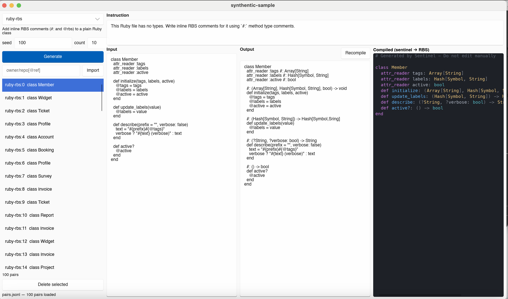

# synthentic-sample

Deterministic, seeded **training-pair generator** for teaching a model to write
[inline RBS](https://github.com/ruby/rbs/blob/master/docs/inline.md) comments in Ruby, built around
[sentinel](https://github.com/AndyGauge/rbs-sentinel) (which transpiles those comments into `.rbs` files).

Each row is an *instruction*, a plain Ruby file (*input*), and the same file with inline RBS added (*output*),
plus what sentinel makes of that output. The rows are meant to feed a fine-tuning pipeline (for example for
gpt-oss-120b) that needs to learn a code style it doesn't already know.



## What it does

- **Generates pairs from a seed.** The same seed gives the same pair on every platform, so a dataset is
  reproducible from `(factory, seed range)`.
- **Is built on an abstract factory.** `PairFactory` is the interface; the Ruby/RBS generator is just one
  implementation. Another language or dialect is another implementation.
- **Compiles every output through sentinel**, so each row carries the real RBS sentinel produced and any
  diagnostics it raised. Rows with warnings are the suspect ones.
- **Imports pairs from the [`ruby/gem_rbs_collection`](https://github.com/ruby/gem_rbs_collection)** (synced by
  the app itself) or from any GitHub repo, by reverse-compiling the real `.rbs` files back into inline RBS.
- **Verifies every imported pair.** The compiled RBS must match the signatures the annotations came from;
  mismatches are flagged in the list and spelled out next to the compiled panel.
- **Has a GUI** to generate, read, edit and delete pairs. Changes are saved to a JSONL file five seconds
  after you stop making them.

## Requirements

- A Rust toolchain (edition 2024). The first build compiles Slint and takes a few minutes.
- [`sentinel`](https://github.com/AndyGauge/rbs-sentinel) on your `PATH` (or configured, see
  [Settings](#settings)). It needs to transpile trailing `attr_*` types, `# @rbs` tags and ivars (see
  [rbs-sentinel#33](https://github.com/AndyGauge/rbs-sentinel/issues/33)); older builds silently drop those.
  If it also supports the `sentinel/transpile` request over `sentinel lsp`, compiling happens in memory in
  about a millisecond per pair; otherwise the app falls back to running `sentinel init` in a temp directory per pair. The compiled panel says
  which of the two is in use ("compiled in memory via sentinel lsp" or "compiled fallback: sentinel init…").
- `git`, for syncing the collection and importing from GitHub.
- `gem` (RubyGems), for downloading gem sources when importing from the collection.

Importing from the collection needs the network (to sync and to download gems). Developed and tested on macOS. Slint is cross-platform, but nothing else has been tried.

## Quick start

```sh
cargo run --release                          # uses ./pairs.jsonl and ./settings.json (if present)
cargo run --release -- data/ruby.jsonl       # a different dataset file
cargo run --release -- --settings my.json    # a different settings file
```

In the window:

1. Pick a factory (`ruby-rbs`), set a start **seed** and a **count**, and click **Generate**. The pairs
   appear immediately and compile in the background ("compiling N…" under the list). The seed field advances
   to the next unused seed, and seeds you already have are skipped.
2. Click a pair to see its instruction, input, output and sentinel's compiled RBS.
   Selecting a pair starts a fresh compile.
3. Edit any of the three text boxes. Editing the output recompiles about 0.8 s after you stop typing;
   **Recompile** does it on demand.
4. **Delete selected** removes a pair. Everything is saved on its own; closing the window saves immediately.

The compiled panel is syntax highlighted. Sentinel's warnings appear under it (for example
`output line 7 warning: malformed signature for 'initialize'…`), anchored to lines in the output.

## Data format

One JSON object per line. This is a real row:

```json
{
  "id": "ruby-rbs:65",
  "factory": "ruby-rbs",
  "seed": 65,
  "instruction": "Add inline RBS type comments using `#:` method type comments, keeping the code itself unchanged.",
  "input": "class Member\n  attr_reader :email\n  attr_reader :age\n\n  def initialize(age, email = \"a@example.com\")\n    @email = email\n    @age = age\n  end\nend\n",
  "output": "class Member\n  attr_reader :email #: String\n  attr_reader :age #: Integer\n\n  #: (Integer, ?String) -> void\n  def initialize(age, email = \"a@example.com\")\n    @email = email\n    @age = age\n  end\nend\n",
  "expected": "",
  "compiled": "# Generated by Sentinel - Do not edit manually\n\nclass Member\n  attr_reader email: String\n  attr_reader age: Integer\n  def initialize: (Integer, ?String) -> void\nend\n",
  "compile_error": null,
  "diagnostics": []
}
```

- `id` is `factory:seed` for generated pairs and unique within a file.
- `expected` is the RBS the output should compile to. It is empty for synthetic pairs and set for imported
  ones, where it is the part of the source RBS the annotations came from.
- `compiled` is sentinel's output for `output`. `compile_error` is set (and `compiled` empty) if sentinel
  failed. `diagnostics` holds `{line, severity, message}` entries from sentinel's language server.
- The file is rewritten atomically (temp file, then rename), so a crash can't truncate it.

## The Ruby/RBS factory

It builds one random class model (typed attributes plus a few methods with required, optional and keyword
parameters, nilable and union types, `Array[...]`, `Hash[...]`) and renders it twice: bare, and annotated.
Because both come from one model, the input and output differ **only** by comments, which is the signal a
model should learn. A test checks this over 500 seeds.

Each sample uses one of two styles for methods:

| Style | Example |
|---|---|
| `#:` method type | `#: (Integer, ?String) -> void` above the `def` |
| `# @rbs` tags | `# @rbs name: String` / `# @rbs return: void` above the `def` |

Attributes get a trailing `#: Type` in both styles.

## Importing

The left-hand panel has two import sections:

- **gem_rbs_collection** (the main source):
  - **Sync** downloads (or updates) the collection and fills the gem picker. A first-time user sees
    "Press Sync to list the collection's gems"; importing syncs on its own too.
  - Pick a gem and press **Import gem** for one gem, or press **Import all gems** for the newest version of
    every gem in the collection (about 170 gems, and several minutes of downloading).
- **GitHub repository**: `owner/repo`, optionally `owner/repo@branch-or-tag`, or a `https://github.com/…` /
  `git@github.com:…` URL, then **Import**.

Imports run in the background and stream their pairs into the list as each gem finishes. The headless
equivalents are `cargo run --release --example import -- gems out.jsonl`, `… -- gem:redis out.jsonl` and
`… -- owner/repo out.jsonl`.

### The gem_rbs_collection

The collection holds signatures only (`gems/<gem>/<version>/*.rbs`), not the Ruby they describe. So for each
gem the app:

1. **Syncs** the collection into a cache directory (`~/.cache/synthentic-sample` by default): a shallow clone
   the first time, a fast-forward afterwards. This happens automatically before an import
   (`collection.auto_sync`), and the **Sync** button does it on its own. If the network is down it
   falls back to the cached copy.
2. **Downloads the gem's source** with `gem unpack NAME --version '~> X.Y.0'` for the collection's `X.Y`
   directory, and caches it. Several gems are fetched at once (`collection.jobs`, default 4).
3. **Reverse compiles** the gem's Ruby against the collection's `.rbs` (below).

### Reverse compiling

Every Ruby file with matching signatures becomes a pair whose input is the plain Ruby and whose output is the
same Ruby with the signatures put back as inline RBS: the reverse of what sentinel does. Signatures are matched
to Ruby by fully-qualified class name, not by file path.

- `def name: SIG` becomes `#: SIG` above the `def`.
- `attr_reader name: T` becomes a trailing `#: T`.
- `@name: T` (when no attribute already covers it) becomes `# @rbs @name: T` at the top of the class.
- Files longer than `github.max_lines` (default 120) are split into **hunks** at member boundaries. Each hunk
  is re-wrapped in its `class`/`module` and `end`s so it stands alone, and its id gets a `#n` suffix.
- Ids look like `ruby-rbs:gem:redis@4.2.5:lib/redis.rb#2` or `ruby-rbs:gh:owner/repo@sha:path/file.rb`, so
  importing the same revision again adds nothing new.

Skipped: Ruby files with no matching signatures (no ground truth), overloaded methods, and `attr_*` lines
naming several symbols.

### Review: does the compiled RBS match?

Each imported pair stores `expected`, the signatures its annotations were generated from. When sentinel
compiles the output, the app parses both and compares them member by member (whitespace and the trailing comma
sentinel adds when it wraps long parameter lists don't count; extra members in sentinel's output are fine).

- A **green dot** in the list means the compiled RBS matches, **red** means it doesn't, **gray** means it is
  still compiling. Synthetic pairs have no dot: they have no ground truth.
- Select a pair to see **✓ matches the source RBS** or **✗ MISMATCH** above the compiled panel, with one line
  per difference (`missing from compiled RBS (expected …)` or `expected …, compiled …`).
- **show mismatches only** filters the list to the red ones, and the line under the list tallies matches and
  mismatches.

On the full collection (174 gems, 172 of which could be fetched, 3,440 pairs) 74% of pairs match exactly. The
other 26% are all members sentinel didn't emit, none are different signatures, and they come from the one-class-
per-file limitation below. A mismatch means either sentinel can't transpile something the annotations say (see
[Known limitations](#known-limitations)) or the pair needs editing; edit the output and it recompiles and
re-checks on its own.

### A GitHub repository

The repo is shallow-cloned and its own `.rbs` files are reverse compiled the same way. Only GitHub
repositories are accepted, and cloning never prompts for credentials, so private repos need working git/SSH
credentials already.

## Settings

A JSON file, `settings.json` in the working directory or the path given to `--settings`. Every field is
optional; see [`settings.example.json`](settings.example.json) for all of them with their defaults.

| Key | Controls |
|---|---|
| `sentinel.command`, `sentinel.args` | The transpiler (default `sentinel init`), used as the fallback compile path |
| `lsp.enabled`, `lsp.command`, `lsp.args` | The language server (default `sentinel lsp`) used for in-memory compile and diagnostics |
| `highlight.enabled` | `false` gives a plain, selectable text box instead of the highlighted panel |
| `highlight.theme.*` | `#rrggbb` colours: `background`, `plain`, `comment`, `keyword`, `type`, `builtin`, `ivar`, `function`, `punct`, `string`, `error`, `warning` |
| `github.git`, `github.max_lines`, `github.exclude_dirs`, `github.max_file_bytes` | The git executable and how imports read a repo or gem |
| `collection.url`, `collection.cache_dir`, `collection.gem`, `collection.auto_sync`, `collection.jobs`, `collection.exclude_dirs` | The signature collection: where it lives and is cached, the `gem` executable, whether to sync before each import, parallel downloads, and directories skipped inside an unpacked gem |

The `SENTINEL_BIN` environment variable overrides the sentinel and LSP commands, which is handy for trying a
different build: `SENTINEL_BIN=/path/to/sentinel-rb cargo run --release`.

## Adding a factory

Implement `PairFactory` (in `src/pair.rs`) and add it to `registry()` in `src/lib.rs`; it then shows up in the
GUI's factory picker.

```rust
pub trait PairFactory: Send + Sync {
    fn id(&self) -> &'static str;
    fn description(&self) -> &'static str;
    /// Pure function of the seed: same seed, same pair, on every platform.
    fn generate(&self, seed: u64) -> Pair;

    // Optional:
    fn compile(&self, source: &str) -> Result<Compiled, String>;     // run the downstream tool
    fn import_extensions(&self) -> &'static [&'static str];           // e.g. [".rb", ".rbs"]
    fn import_files(&self, repo: &str, files: &[SourceFile], opts: &ImportOptions) -> Vec<Pair>;
}
```

`generate` should use the provided `Rng` (`src/rng.rs`, a hand-rolled SplitMix64) rather than an external
crate, so a dependency upgrade can never change what a seed produces.

## Layout

| Path | What |
|---|---|
| `src/pair.rs` | `Pair`, `PairFactory`, `Compiled`, `Diagnostic` |
| `src/factories/ruby_rbs.rs` | The Ruby/RBS factory (generation, compile, import) |
| `src/factories/rbs_reverse.rs` | The reverse annotator (also yields each pair's `expected` RBS) |
| `src/factories/ruby_hunks.rs` | Splitting long Ruby files into standalone hunks |
| `src/factories/sentinel.rs`, `src/lsp.rs` | Running `sentinel init` / talking to `sentinel lsp` |
| `src/collection.rs` | Syncing `gem_rbs_collection`, fetching gem sources, building pairs per gem |
| `src/rbs.rs` | A small RBS reader and the member-by-member comparison behind the match check |
| `src/github.rs` | Cloning and reading a repository |
| `src/highlight.rs`, `src/ui.rs`, `ui/app.slint` | Highlighting and the Slint UI |
| `src/store.rs`, `src/settings.rs`, `src/rng.rs` | JSONL store, settings, RNG |
| `examples/import.rs`, `examples/snapshot.rs` | Headless import; render the window to raw RGBA |

## Development

```sh
cargo test --lib                                   # unit tests
cargo test --lib -- --include-ignored --nocapture  # also prints sentinel's coverage over 100 generated pairs
SENTINEL_BIN=/path/to/sentinel-rb cargo test --lib # exercise the in-memory compile path
```

Tests that need sentinel skip themselves when it isn't installed.

## Known limitations

- Sentinel does not attach `#:` to `private def foo` / `protected def foo`. Imports annotate those methods
  anyway (it is valid inline RBS) and the warning lands in the pair's `diagnostics`, so you can filter them.
- Sentinel transpiles **one class per file**: the first `class` it finds, wrapped in its enclosing modules.
  Other classes, and the members of an enclosing `module`, are dropped, so those pairs are flagged as
  "missing from compiled RBS". Over the whole collection this accounts for every mismatch (see below).
  The pair is best dropped or split until sentinel supports multi-class files.
- Repos with inline annotations but no `.rbs` files import nothing.
- Hunking is indentation based, not a parser. A single member longer than `max_lines` stays whole.
- Only the compiled panel is highlighted: the editable Input and Output boxes can't show colours.

## License

Licensed under either of

- [Apache License, Version 2.0](LICENSE-APACHE)
- [MIT license](LICENSE-MIT)

at your option. Unless you explicitly state otherwise, any contribution intentionally submitted for inclusion
in this work, as defined in the Apache-2.0 license, shall be dual licensed as above, without any additional
terms or conditions.

See [CHANGELOG.md](CHANGELOG.md) for what has changed.
